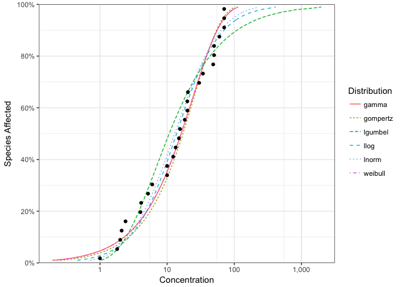

<!-- README.md is generated from README.Rmd. Please edit that file -->

<div id="devex-badge">

<a rel="Exploration" href="https://github.com/BCDevExchange/docs/blob/master/discussion/projectstates.md">
[](https://travis-ci.org/bcgov/ssdca)
[](https://codecov.io/github/bcgov/ssdca?branch=master)

# ssdca

`ssdca` is an R package to fit distributions to Species Sensitivity
Data. It is being developed for the B.C. Ministry of Environment by
[Poisson Consulting](https://github.com/poissonconsulting).

## Installation

To install the latest version:

``` r
# install.packages("devtools")
devtools::install_github("bcgov/ssdca")
```

## Introduction

`ssdca` loads `fitdistrplus`, which it extends, as well several other
packages.

``` r
library(ssdca)
#> Loading required package: actuar
#> 
#> Attaching package: 'actuar'
#> The following object is masked from 'package:grDevices':
#> 
#>     cm
#> Loading required package: VGAM
#> Loading required package: stats4
#> Loading required package: splines
#> 
#> Attaching package: 'VGAM'
#> The following objects are masked from 'package:actuar':
#> 
#>     dgumbel, dlgamma, dpareto, pgumbel, plgamma, ppareto, qgumbel,
#>     qlgamma, qpareto, rgumbel, rlgamma, rpareto
#> Loading required package: FAdist
#> 
#> Attaching package: 'FAdist'
#> The following objects are masked from 'package:VGAM':
#> 
#>     dgev, dgumbel, pgev, pgumbel, qgev, qgumbel, rgev, rgumbel
#> The following objects are masked from 'package:actuar':
#> 
#>     dgumbel, pgumbel, qgumbel, rgumbel
#> Loading required package: fitdistrplus
#> Loading required package: MASS
#> Loading required package: survival
#> 
#> Attaching package: 'ssdca'
#> The following object is masked from 'package:VGAM':
#> 
#>     AICc
```

`ssdca` provides a data set for several chemicals including Boron.

``` r
boron_data <- ccme_data[ccme_data$Chemical == "Boron",]
boron_data
#> # A tibble: 28 x 4
#>    Chemical                 Species  Conc  Group
#>       <chr>                   <chr> <dbl> <fctr>
#>  1    Boron     Oncorhynchus mykiss   2.1   Fish
#>  2    Boron     Ictalurus punctatus   2.4   Fish
#>  3    Boron   Micropterus salmoides   4.1   Fish
#>  4    Boron       Brachydanio rerio  10.0   Fish
#>  5    Boron       Carassius auratus  15.6   Fish
#>  6    Boron     Pimephales promelas  18.3   Fish
#>  7    Boron           Daphnia magna   6.0 Invert
#>  8    Boron Opercularia bimarginata  10.0   Fish
#>  9    Boron      Ceriodaphnia dubia  13.4   Fish
#> 10    Boron     Entosiphon sulcatum  15.0   Fish
#> # ... with 18 more rows
```

Multiple distributions can be fit using `ssd_fit_dists()`

``` r
boron_dists <- ssd_fit_dists(boron_data$Conc, c("lnorm", "weibull"))
boron_dists
#> Fitting of the distribution ' lnorm ' by maximum likelihood 
#> Parameters:
#>         estimate Std. Error
#> meanlog 2.561645  0.2346291
#> sdlog   1.241540  0.1659073
#> Fitting of the distribution ' weibull ' by maximum likelihood 
#> Parameters:
#>         estimate Std. Error
#> shape  0.9662825  0.1454446
#> scale 23.5097478  4.8528313
```

and plot using the `ggplot2` generic `autoplot`

``` r
library(ggplot2)
autoplot(boron_dists)
```

<!-- -->

Model-averaged predictions complete with confidence intervals can be
produced using the `stats` generic.

``` r
boron_avg <- predict(boron_dists)
boron_avg
#> # A tibble: 50 x 5
#>     prob       est        se       lcl      ucl
#>    <dbl>     <dbl>     <dbl>     <dbl>    <dbl>
#>  1  0.01 0.3734021 0.4148189 0.1371074 1.305276
#>  2  0.03 0.8392824 0.6428154 0.3289583 2.481830
#>  3  0.05 1.2837853 0.8102746 0.5306787 3.443798
#>  4  0.07 1.7279895 0.9568253 0.7508149 4.282702
#>  5  0.09 2.1777331 1.0931223 0.9993348 5.102960
#>  6  0.11 2.6358033 1.2237814 1.2608493 5.893507
#>  7  0.13 3.1039463 1.3512574 1.5356124 6.683256
#>  8  0.15 3.5834693 1.4770252 1.8249363 7.452239
#>  9  0.17 4.0754784 1.6020497 2.1016645 8.103790
#> 10  0.19 4.5809907 1.7270058 2.3912495 8.836973
#> # ... with 40 more rows
```

and plotted together with the original data using `ssd_plot` to produce
a publication quality plot.

How to use `ssdca` in conjuction with `fitdistrplus` and `ggplot2` to
assess alternative fits and produce custom plots is described in the
ssdca vignette.

A shiny webpage is being developed for non-users of R.

## Getting Help or Reporting an Issue

To report bugs/issues/feature requests, please file an
[issue](https://github.com/bcgov/ssdca/issues/).

## How to Contribute

If you would like to contribute to the package, please see our
[CONTRIBUTING](CONTRIBUTING.md) guidelines.

Please note that this project is released with a [Contributor Code of
Conduct](CODE_OF_CONDUCT.md). By participating in this project you agree
to abide by its terms.

## License

The code is released under the Apache License 2.0

    Copyright 2015 Province of British Columbia
    
    Licensed under the Apache License, Version 2.0 (the "License");
    you may not use this file except in compliance with the License.
    You may obtain a copy of the License at 
    
       http://www.apache.org/licenses/LICENSE-2.0
    
    Unless required by applicable law or agreed to in writing, software
    distributed under the License is distributed on an "AS IS" BASIS,
    WITHOUT WARRANTIES OR CONDITIONS OF ANY KIND, either express or implied.
    See the License for the specific language governing permissions and
    limitations under the License.

The data are licensed under the ([Open Government Licence -
Canada](http://open.canada.ca/en/open-government-licence-canada)). See
the `data-raw` folder for more information.
